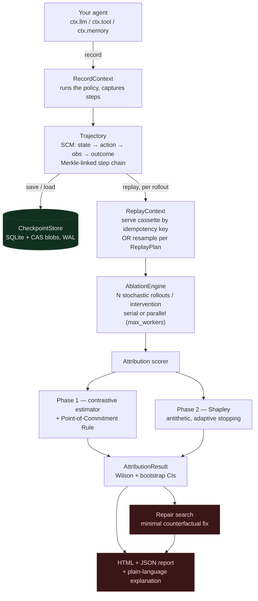
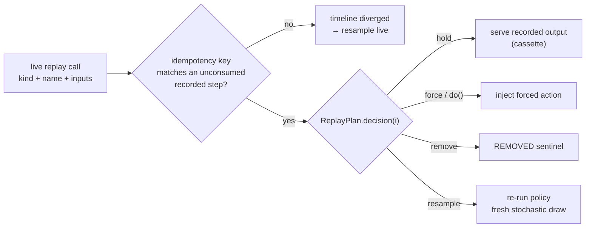
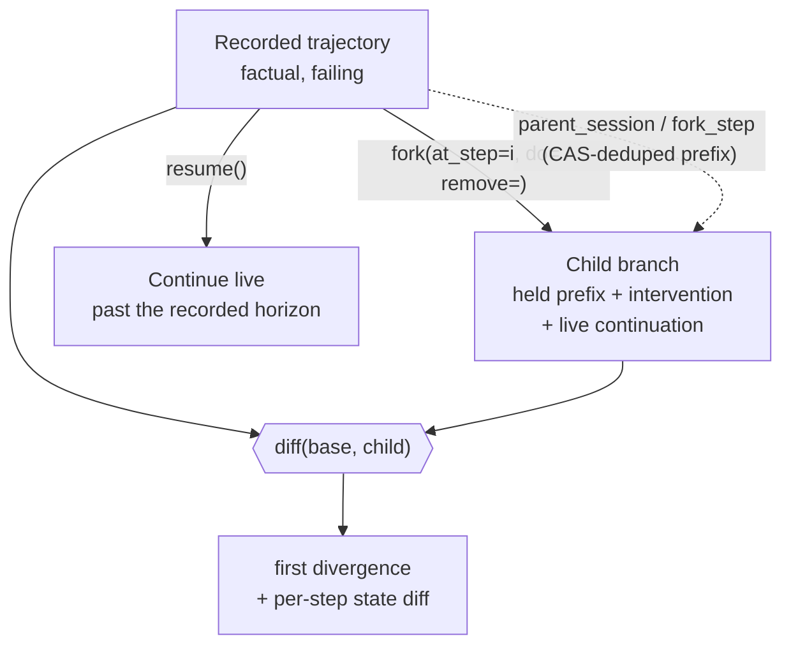

# agent-replay

**Find *which step* caused your AI agent to fail — with causal proof, not correlational guesswork.**

`agent-replay` records an AI agent's trajectory (LLM calls, tool calls, memory
operations) as a checkpointed, deterministically-replayable session, then
attributes a failure to a specific step by **counterfactual step-ablation**:
re-run the trajectory with one step perturbed and measure how the failure
probability shifts.

```
attribution(step i) = P(fail | step i kept) − P(fail | step i ablated)
```

This is the software-level realization of the *Trajectory Causal Attribution*
method: formalize the run as a Structural Causal Model, intervene on one step at
a time, and use the **Point-of-Commitment Rule** and **Shapley-value attribution**
to localize the true root cause — instead of blaming the step that mechanically
executed the harmful action (a category error) or an LLM-as-judge (≈14% accuracy
on the *Who&When* benchmark).

- 🎯 **Causal, not correlational** — real `do()`-calculus interventions on a replayable trajectory.
- 🧩 **Framework-agnostic** — a tiny decorator/wrapper API that works with *any* Python agent. Optional LangChain / OpenAI-SDK adapters included.
- 🌿 **Branch-safe** — live replay calls bind to recorded steps by **idempotency key** (kind + name + inputs), so agents whose step sequence depends on earlier outputs are attributed correctly, not just linear ones.
- 💾 **Checkpointed** — SQLite store with content-addressable, deduplicated blobs and a Merkle-linked step chain.
- 🔁 **Deterministic replay** — the VCR/cassette pattern: recorded steps are served verbatim; only ablated steps re-run.
- 📊 **Rigorous** — Wilson score + bootstrap confidence intervals, antithetic Shapley sampling, no coalition caching.
- 🛠 **Actionable** — searches for a *minimal counterfactual repair* and emits an HTML + JSON failure-attribution report.
- 🔎 **Honest** — attributing a *passing* run raises by default (or runs the symmetric **credit** analysis: which step secured success); observation-only / non-resamplable steps are flagged, never silently scored zero.
- 🪶 **Zero runtime dependencies** — pure Python standard library.

📖 **[Documentation site](https://krishddd.github.io/Trajectory_Causal_Attribution/)** · [Changelog](CHANGELOG.md)

---

## Install

```bash
pip install agent-replay
# optional integrations:
pip install "agent-replay[langchain]"
pip install "agent-replay[openai]"
```

Requires Python 3.9+.

---

## Quickstart (20-line integration)

```python
from agent_replay import Session, attribute

def my_agent(ctx, question):
    plan  = ctx.llm("plan",   produce=lambda: {"q": question}, prompt=question)
    hits  = ctx.tool("search", produce=lambda: ("bug" if ctx.rng.random() < 0.7 else "ok"), q=plan["q"])
    draft = ctx.llm("write",  produce=lambda: hits, context=hits)
    return {"answer": draft, "ok": draft == "ok"}

def verifier(result):                       # 1.0 == success, 0.0 == failure
    return 1.0 if result["ok"] else 0.0

with Session("demo.sqlite") as session:
    traj   = session.record(my_agent, {"question": "why did it fail?"}, seed=3, verifier=verifier)
    result = attribute(traj, my_agent, verifier, rollouts=60, method="both", repair=True)
    result.to_html("report.html")
    result.to_json("report.json")
    print("culprit step:", result.culprit_index)   # -> the step that caused the failure
```

The only thing your agent has to do is route its non-deterministic work through
the context handle — `ctx.llm(...)`, `ctx.tool(...)`, `ctx.memory(...)` — passing
a `produce` callable that *is* the policy for that step, and drawing any
randomness from `ctx.rng`. The **same function** is used for recording and for
every counterfactual rollout; that is what makes attribution possible.

---

## The CLI

The CLI points at **your own** agent and verifier via `module:function`
entrypoints — the package ships no bundled agents. Given a `myproject/agents.py`
that exposes an agent (routing its work through `ctx`, as in the Quickstart) and a
verifier:

```bash
# 1. record a factual run into a checkpoint store
agent-replay record --db demo.sqlite --session run1 \
    --agent myproject.agents:support_agent \
    --verifier myproject.agents:answered_correctly --seed 1

# 2. deterministically replay it (fast-forward through the recorded decisions)
agent-replay replay --db demo.sqlite --session run1 \
    --agent myproject.agents:support_agent \
    --verifier myproject.agents:answered_correctly

# 3. attribute the failure + generate reports + propose a repair
agent-replay attribute --db demo.sqlite --session run1 \
    --agent myproject.agents:support_agent \
    --verifier myproject.agents:answered_correctly \
    --rollouts 60 --method both --repair --out report

# 4. regenerate the HTML report from a saved JSON report
agent-replay report --json report.json --out report.html
```

Sample output:

```
============================================================
TRAJECTORY CAUSAL ATTRIBUTION REPORT
============================================================
Session:      run1
Total steps:  6
Outcome:      FAILED (verifier score: 0.000)
Method:       both  (60 rollouts/step)
------------------------------------------------------------
Point-of-Commitment: step 3
[RESULT] Failure attributed to step 3 (tool tool_step_3) with score 0.700.
         CI [0.560, 0.820]
[REPAIR] step 3: 'BAD' -> 'OK' (valid, minimality 0.400, P(fail)->0.000)
============================================================
```

---

## Architecture

The end-to-end pipeline: record a factual run once, then re-run it many times
under counterfactual interventions to localize — and repair — the failure.



**The replay decision — how each live call binds to the cassette.** This is the
branch-safe core: a held step is served from the recording only when the *same*
operation actually recurs; otherwise the timeline has diverged and the call is
resampled live.



### How the causal attribution works

1. **Record** the factual run. Each step's inputs/outputs are stored (content-addressed, deduplicated) and chained into a Merkle-style hash sequence.
2. **Phase 1 — single-step contrastive estimation.** For every step `i`, hold steps `< i` at their factual recorded actions, **resample** step `i` and everything downstream, and run forward `N` times. Compute `attribution(i) = P(fail|kept) − P(fail|ablated)` with a Wilson interval on the ablated failure rate and a bootstrap interval on the difference.
3. **Point-of-Commitment Rule.** Because resampling an early step re-rolls the fatal late step too (a butterfly-effect confound), *magnitude alone blames early, irrelevant steps*. Instead we take the **latest** step whose interval still strictly excludes zero — the final juncture at which re-deciding can still rescue the run. That is the true causal locus.
4. **Phase 2 — Shapley attribution.** For interacting (AND/OR) failures, single-step ablation double-counts or zeroes-out credit. Shapley values split responsibility fairly by averaging each step's marginal contribution over sampled permutations, using **antithetic reverse-permutation pairing** for variance reduction. Coalition values are deliberately **never cached** (that would collapse marginal variance and yield falsely narrow intervals) and **no truncation** is used (it would skip pivotal late steps).
5. **Repair.** The culprit step's action is swapped for candidate repairs via a `do()` intervention; a candidate that flips the failure rate below threshold and has maximum **minimality** (least behavioural drift) is reported as the validated counterfactual repair.

### Scope note

The source research (*The Chronos Protocol* / *Agent Time-Travel Debugger*)
describes OS-level substrates — DeltaFS/DeltaCR millisecond checkpoints, CRIU,
Firecracker microVMs, WASI-Virt — for capturing full process/filesystem state.
`agent-replay` implements the **framework-agnostic, application-level** essence
of that vision: deterministic record/replay via recorded cassettes plus the full
causal-attribution mathematics, with zero external dependencies. The exotic
kernel primitives are intentionally out of scope; the attribution algorithm does
not depend on them.

---

## Public API

| Symbol | Purpose |
|---|---|
| `Session(db_path)` | Record and persist agent runs to a SQLite store. |
| `session.record(agent_fn, task, seed, verifier)` | Capture one factual `Trajectory`. |
| `attribute(traj, agent_fn, verifier, rollouts, method, repair)` | Run the attribution pipeline → `AttributionResult`. |
| `AttributionResult.to_html(path)` / `.to_json(path)` | Emit the failure-attribution report. |
| `record(...)` | Low-level one-shot recording (no store). |
| `replay(agent_fn, traj, plan, seed)` | Deterministic replay under a `ReplayPlan`. |
| `ReplayPlan.factual / .ablate_from / .coalition` | Build intervention plans. |
| `AblationEngine` | Run stochastic rollouts for a plan. |
| `find_minimal_repair(engine, step)` | Search for a minimal counterfactual repair. |
| `interop.from_otel_spans / from_jsonl / from_steps` | Import a `Trajectory` from an external trace. |
| `interop.replayable_agent(traj, resample_fns)` | Make an imported trace attributable. |
| `aggregate_runs(trajectories, agent, verifier)` | Pool attribution across runs → systematic weak step. |
| `CheckpointStore` | The SQLite checkpoint / content-addressable store. |

`method` is `"contrastive"` (Phase 1), `"shapley"` (Phase 2), or `"both"`.

---

## Connect any framework

Three ways to feed steps in, from explicit to fully automatic — all produce the
same `Trajectory`. Full guide: [`docs/frameworks.md`](docs/frameworks.md).

**Decorate any callable** (no `ctx` threading — uses an ambient context):

```python
from agent_replay import instrument

@instrument.tool
def search(q): ...
@instrument.llm
def answer(ctx): ...

def agent(question):                       # no ctx parameter
    return {"answer": answer(search(question))}

traj   = instrument.record_agent(agent, {"question": "..."}, session_id="s", verifier=v)
result = attribute(traj, agent, v, pass_context=False)
```

**Auto-instrument an unmodified SDK** via the data-only recipe registry
(OpenAI, Anthropic, Cohere, Google GenAI, Mistral, LiteLLM, LangChain,
LlamaIndex, CrewAI, AutoGen — best-effort, absent SDKs skipped):

```python
from agent_replay import instrument
instrument.available_frameworks()          # -> the list above
with instrument.installed("openai", "langchain"):
    traj = instrument.record_agent(run_my_crew, {...}, session_id="s", verifier=v)
```

Not in the registry? Patch any dotted callable — this is how the recipes work,
so it covers every framework: `instrument.patch("my_fw.LLM.complete", kind="llm")`.

## Import a trace recorded anywhere

Already have traces in LangSmith / Langfuse / AgentOps, an OpenTelemetry export,
or a JSONL log? `agent_replay.interop` turns them into a first-class `Trajectory`
you can diff, serve, hash — and attribute. Attribution needs to *re-run* a step's
policy, which a recorded trace doesn't contain, so you supply a resample policy
per step kind (or name); steps without one stay observation-only.

```python
from agent_replay import attribute, interop

traj  = interop.from_otel_spans(otel_spans, session_id="prod-run-42")   # or from_jsonl(...)

# Make it attributable: give the steps you want perturbed a resample policy.
def llm_policy(ctx, inputs):     # re-draw this step's output from its recorded inputs
    return call_your_model(inputs["messages"], temperature=0.7)

agent = interop.replayable_agent(traj, resample_fns={"llm": llm_policy})
result = attribute(traj, agent, my_verifier, rollouts=60)
print(result.culprit_index)      # which step caused the failure — on an imported trace
```

`from_otel_spans` follows the OpenTelemetry **GenAI** semantic conventions
(`gen_ai.*` attributes → `llm` steps, `execute_tool` / `gen_ai.tool.name` →
`tool` steps) and is deliberately tolerant — unknown spans import as opaque tool
steps rather than being dropped.

## Proof: the Who&When benchmark

Localizing the *responsible step* in a failed trajectory is the *Who&When* task
(arXiv:2505.00212), where the strongest LLM-as-judge attributor reaches only
**~14.2%** step accuracy. `benchmarks/whowhen.py` measures this tool on
ground-truth-labelled trajectories:

```bash
python benchmarks/whowhen.py
```

```
  causal attribution (this tool)  : 100.0%  (8/8)
  max-magnitude (no PoC rule)     :  12.5%  (1/8)
  last-step baseline              :  37.5%  (3/8)
  LLM-as-judge (Who&When lit.)    :  ~14.2%  (arXiv:2505.00212)
```

The `max-magnitude` row — highest-|attribution| step *without* the
Point-of-Commitment rule — lands near the judge baseline, quantifying exactly
what the PoC rule buys. The harness ships a deterministic synthetic generator so
it runs offline; point `evaluate()` at `interop`-imported trajectories to run the
real dataset. See [`benchmarks/README.md`](benchmarks/README.md).

## Find your agent's *systematic* weak step

Attributing one failure tells you which step broke *that* run. `aggregate` pools
attribution across many failing runs of the same task and ranks steps by **name**
(the stable identity of an operation) — so you can tell bad luck (culprit in 1 of
20 runs) from a design flaw (culprit in 15 of 20):

```python
from agent_replay import aggregate_runs

agg = aggregate_runs(failing_trajectories, my_agent, my_verifier, rollouts=50)
print(agg.systematic_culprit)     # e.g. "tool:web_search" — the step most consistently to blame
print(agg.to_text())
```

```
Aggregate attribution for 'support-agent': 18 failing runs
  Systematic weak step: tool:web_search
  step                     culprit   mean attr [95% CI]     poc
    tool:web_search        15/18  83%   0.71 [ 0.55, 0.86]  15/18
    llm:plan                2/18  11%   0.14 [ 0.02, 0.29]   2/18
    llm:write               1/18   6%   0.05 [-0.03, 0.14]   1/18
```

Or over a whole checkpoint store from the CLI:

```bash
agent-replay aggregate --db runs.sqlite --agent myproj:agent --verifier myproj:ok --rollouts 60
```

## Explainable output

Every attribution can be rendered as a traceable, plain-language explanation —
**what** went wrong, **where**, **why**, and **how to fix** it — with a per-step
causal trace from the first action to the point of no return. The estimators are
unchanged; this is a presentation layer.

```python
explanation = result.explain(traj)
print(explanation.to_text())               # ASCII-safe narrative
result.to_html("report.html", explanation=explanation)   # adds an Explanation panel
```

```
WHAT:  The run failed (score 0.00). The decisive error is step 3. Its action was 'BAD'.
WHERE: Step 3 - tool:tool_step_3.
WHY:   Keeping step 3 fails 1.00 of the time; re-deciding it drops failure to 0.78
       (rescue 0.22). It is the latest step where re-deciding still changes the
       outcome; the 2 steps after it stay failing, so the run is locked in beyond here.
FIX:   Constrain step 3 from 'BAD' toward '' (validated repair, P(fail)->0.00).

Causal trace (first action -> point of no return):
   + step 0 [llm:reason_step_0] contributing  (butterfly effect; blame resolves later)
  >> step 3 [tool:tool_step_3] decisive        (the point of commitment)
   x step 4 [llm:reason_step_4] locked-in      (outcome already committed)
```

The CLI prints this automatically (`--no-explain` to suppress) and embeds it in
the HTML/JSON reports.

---

## Test your agent (pytest)

Gate CI on agent reliability. `assert_agent_passes` runs the agent many times
(agents are stochastic — one green run is not a pass), fails the test if the
failure rate exceeds budget, and on failure puts a counterfactual attribution —
*which step broke, why, and the minimal fix* — into the test output.

```python
from agent_replay.pytest_plugin import assert_agent_passes

def test_my_agent():
    assert_agent_passes(my_agent, {"q": "..."}, my_verifier,
                        rollouts=40, p_fail_max=0.05,
                        report_path="agent_failure.html")  # HTML artifact on failure
```

## Faster, cheaper attribution

`adaptive=True` uses sequential stopping — rollouts accrue only until each step's
interval is tight enough (decisive steps stop early), typically several-fold
fewer rollouts with the same verdict:

```python
result = attribute(traj, agent, verifier, rollouts=200, adaptive=True, target_ci_width=0.2)
```

## Analyze once, pay once

`attribute`, `drift` and `faithfulness` re-run the same prefix-hold rollouts on a
run. Share a `RolloutCache` so the second and third analysis reuse the first's —
or use the `analyze` wrapper, which does it for you:

```python
from agent_replay import analyze

out = analyze(traj, agent, verifier, rollouts=50, state_scorer=my_health_fn)
out["attribution"].culprit_index
out["drift"].commitment_index
out["cache"].hits           # rollouts reused instead of recomputed
```

Shapley coalition rollouts are never cached (they must stay independent draws for
valid variance); only the prefix-hold / factual plans are shared. Results are
byte-identical to running each analysis on its own.

## Async agents

`async def` agents just work — `record` / `replay` / `attribute` detect coroutine
agents and run them through the same pipeline (Shapley, repair, branch-safety
included):

```python
async def agent(ctx, q):
    plan = await ctx.llm("plan", produce=lambda: call_model(q))
    ...
traj   = record(agent, {"q": "..."}, session_id="s", verifier=v)   # auto-detected
result = attribute(traj, agent, v)                                  # sync API, async agent
```

## The intervention algebra

Attribution rests on `do()`-calculus interventions on one step. The full set the
research describes is available, both as `ReplayPlan`s and through `fork`:

| Intervention | What it changes | How |
|---|---|---|
| **resample** | re-draw the step's action from its policy | default |
| **do / force** | override the step's **action** | `fork(..., do=value)` |
| **remove** | drop the step entirely | `fork(..., remove=True)` |
| **mock-observe** | override the **observation**, keep the recorded action | `fork(..., observe=value)` |
| **swap-model** | run the step under a different model | `fork(..., model="gpt-5")` |

The SCM separates the policy's *action* from the *observation* it yields. Record
both when they differ — the agent's chosen call is the action, the environment's
return is the observation:

```python
def agent(ctx, q):
    result = ctx.tool("search",
                      produce=lambda: choose_query(q),        # the action
                      observe=lambda call: run_search(call))  # the observation
    return {"answer": result}
```

Then `mock-observe` tests memory/context reliance (keep the action, inject a
different observation), and `swap-model` asks whether a different model would have
recovered — a policy reads `ctx.model_hint` to switch:

```python
from agent_replay import fork
mocked = fork(agent, traj, at_step=1, observe="empty search results")
upgraded = fork(agent, traj, at_step=1, model="gpt-5")   # policy reads ctx.model_hint
```

## The Multiverse: fork, resume, diff, faithfulness, drift

Beyond attributing a single failure, agent-replay realizes the *Agent Multiverse*
vision at the application level (see [`docs/MULTIVERSE_GAPS.md`](docs/MULTIVERSE_GAPS.md)):




```python
from agent_replay import fork, resume, diff, faithfulness, drift

# Fork an alternate timeline at step 3 (force or remove the step's action),
# recorded as a first-class child branch (shared prefix deduped via the CAS store).
alt = fork(agent, traj, at_step=3, do="OK", session_id="fixed")
print(diff(traj, alt)["first_divergence"])          # where the timelines split

# Durable resume: fast-forward the recorded prefix, continue live past the horizon.
live = resume(agent, traj)

# Step-level faithfulness: does the reasoning actually drive the answer?
fr = faithfulness(traj, agent, verifier)
print(fr.quadrant)      # correct/wrong x faithful/unfaithful; flags post-hoc rationalization

# Drift / entropy-of-autonomy curve: chart a run's health as it unfolds.
dr = drift(traj, agent, verifier, state_scorer=my_health_fn)   # state_scorer optional
print(dr.commitment_index)      # step where the outcome's fate seals (entropy collapses)
dr.to_html("drift.html")        # standalone SVG curve
```

`drift` needs only the outcome verifier for the entropy curve (how *open* the run's
fate still is at each step); an optional `state_scorer(step) -> [0,1]` adds an
alignment-health overlay and flags **silent decay** — internal health degrading
before the outcome reflects it. Browse it all in the zero-dependency console:

```bash
agent-replay serve --db demo.sqlite         # sessions, frozen per-step state, branch graph
agent-replay fork  --db demo.sqlite --session run1 --agent … --at-step 3 --do '"OK"'
agent-replay drift --db demo.sqlite --session run1 --agent … --verifier … \
    --state-scorer mypkg:health --out drift.html
```

## Deployable step-wise fixes

The validated repair becomes a runtime guard and training data:

```python
result = attribute(traj, agent, verifier, repair=True,
                   repair_propose_fn=my_llm_proposer)   # optional: LLM-proposed candidates
print(result.repair.to_guard())                         # deploy-time recovery snippet

from agent_replay import export_contrastive_pairs
export_contrastive_pairs([result], "pairs.jsonl")       # (wrong -> fix) pairs for DPO
```

---

## Development

```bash
pip install -e ".[dev]"
pytest -q                     # full suite (mock agent with a known-culprit step)
ruff check . && ruff format --check .
python -m build               # sdist + wheel
python examples/quickstart.py # generates report.html / report.json
```

CI (GitHub Actions) runs ruff lint + format checks, the pytest suite on Python
3.9–3.12 with coverage, and a distribution build.

---

## License

MIT © agent-replay contributors. See [LICENSE](LICENSE).
